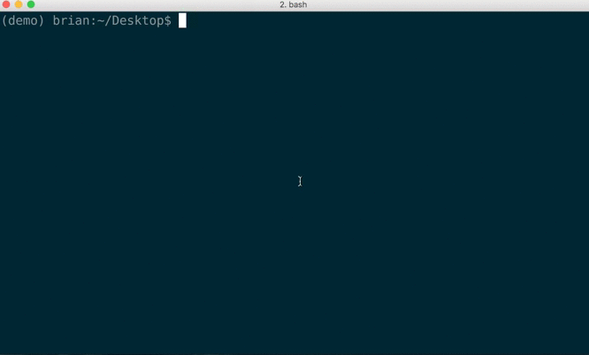

#   

A Python package that gives you the power to extract any compressed file using the same simple syntax.

## Usage
`$ kai yourfile.tar`

## Installation
`$ pip install kai`

## Contributing
Want to contribute? Great! Fork and submit a pull request!

## Todos

 - Support binzip files
 - Support 7zip files
